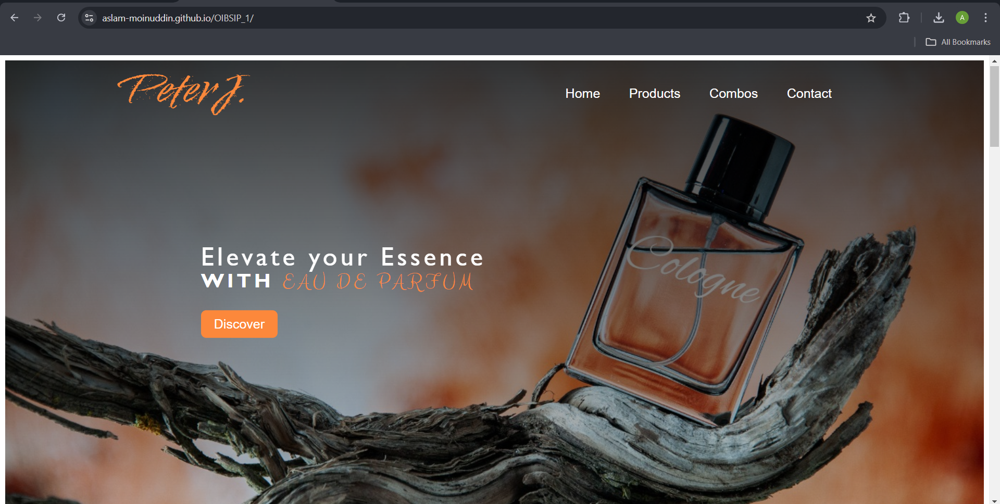

# PeterJ Perfumes

Welcome to the **PeterJ Perfumes** landing page repository! This project showcases a stylish landing page for a luxury perfume brand. It features a clean design, smooth transitions, and a responsive layout to provide an excellent user experience.

## Table of Contents

- [Overview](#overview)
- [Features](#features)
- [Installation](#installation)

## Overview

This landing page highlights different perfume products and combos with a modern design. The site includes:

- A captivating hero section
- Detailed product sections with images and descriptions
- A section showcasing perfume combos
- A contact form for inquiries


## Features

- **Responsive Design**: Adapts seamlessly to various screen sizes.
- **Smooth Transitions**: Hover effects and animations enhance the user experience.
- **Stylish Layout**: Use of gradients and background images to create an appealing visual effect.
- **Contact Form**: Simple form to collect user information and inquiries.

## Installation

To run this project locally, follow these steps:

1. **Clone the repository**:
   ```bash
   git clone https://github.com/Aslam-Moinuddin/OIBSIP_1.git
2. **Navigate to the project directory:**
   ```bash
   cd OIBSIP_1
3. **Open with Live Preview: You can open the project with a live preview in your preferred editor.**